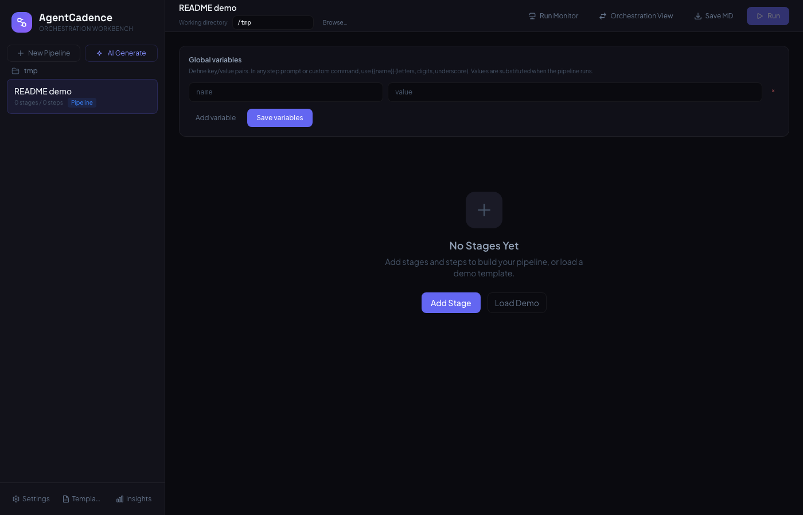
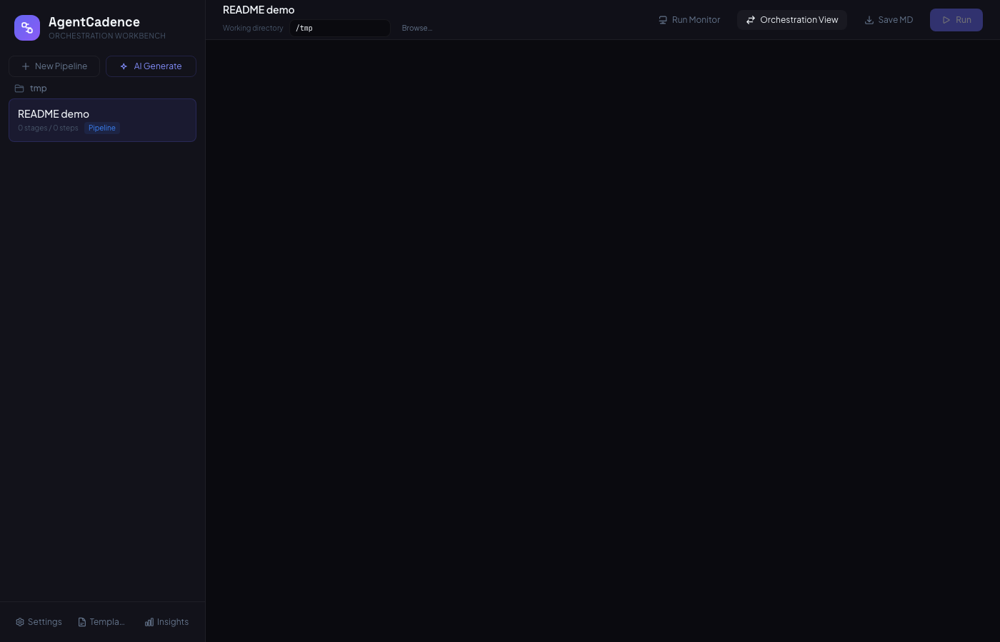
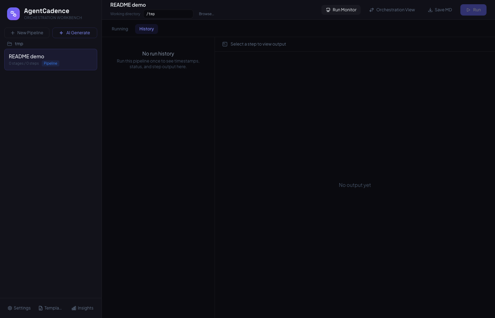
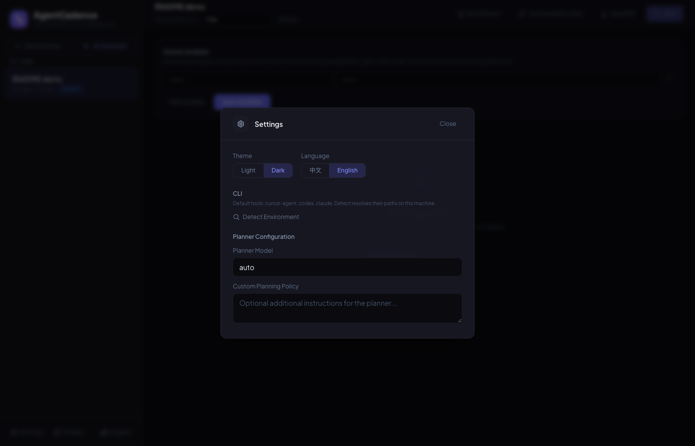
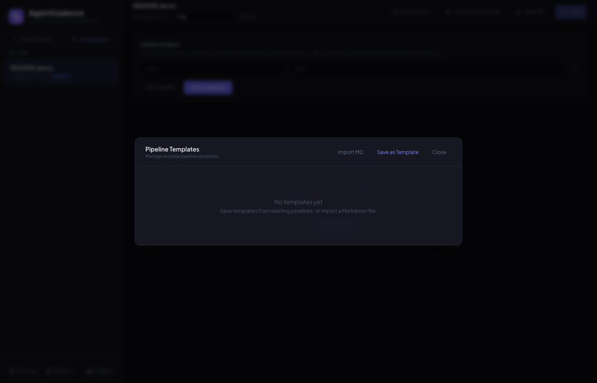
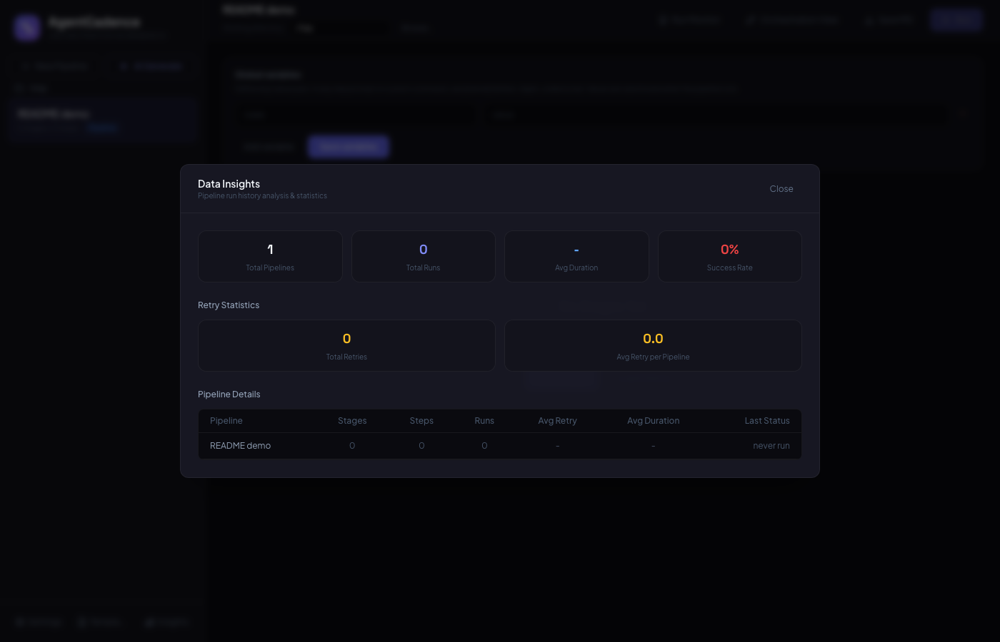
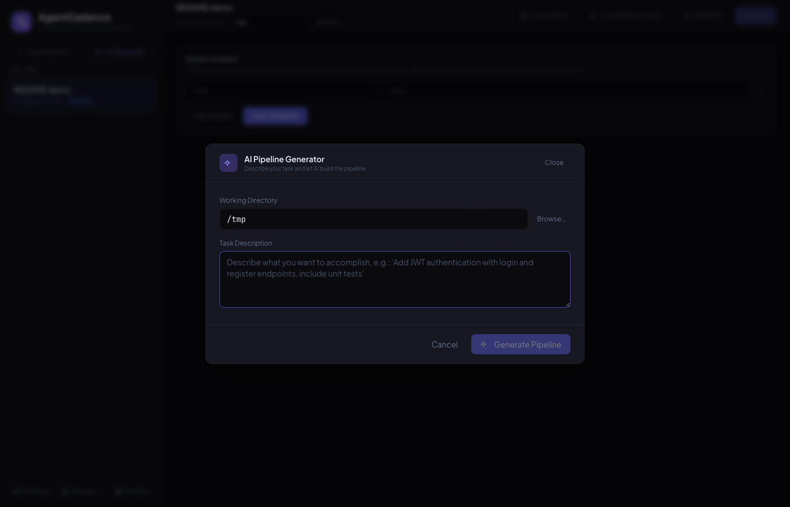

<p align="center">
  <strong>AgentCadence</strong><br/>
  <em>Universal CLI orchestration workbench for the web — run Cursor, Claude Code, and Codex in pipelines with DAG scheduling, live monitoring, and AI-assisted pipeline generation.</em>
</p>

<p align="center">
  <a href="https://github.com/toddwyl/AgentCadence/blob/main/LICENSE"></a>
  <a href="https://nodejs.org/"></a>
  <a href="https://github.com/toddwyl/AgentCadence"></a>
</p>

---

## Table of contents

- [Overview](#overview)
- [Features](#features)
- [Preview](#preview)
- [Requirements](#requirements)
- [Installation](#installation)
- [Running](#running)
- [Configuration](#configuration)
- [Using AgentCadence](#using-agentcadence)
- [Automation & tests](#automation--tests)
- [Development](#development)
- [Related projects](#related-projects)
- [Credits](#credits)
- [License](#license)

---

## Overview

**AgentCadence** is a TypeScript web application that lets you **design multi-stage pipelines**, **execute agent CLIs** (e.g. `cursor-agent`, `claude`, `codex`) from the server, and **watch runs in real time** with history, retries, and per-step output — similar in spirit to desktop workflow tools, but in the browser.

Typical use cases:

- Orchestrate coding / review / verify steps across **parallel** and **sequential** stages.
- Centralize **working directory**, **global variables** (`{{name}}` substitution), and **templates** (Markdown import/export).
- Use **AI Pipeline Generator** to draft a pipeline from a natural-language task (planner uses your configured CLI).
- Inspect **Data Insights** over past runs (duration, retries, model usage where applicable).

---

## Features

| Area | What you get |
|------|----------------|
| **Pipelines** | Stages with **parallel** or **sequential** execution; steps with tool, model, prompt, optional custom shell command, retry policy. |
| **Execution** | Server-side DAG scheduler; WebSocket updates; **Run Monitor** with **Running** + **History** tabs; step output persisted on the server. |
| **CLI** | Per-tool executable and flags in **Settings**; **Detect environment** to resolve `cursor-agent`, `codex`, `claude` on the host machine. |
| **Templates** | Save/load pipelines as Markdown; import/export for reuse. |
| **i18n** | English / 中文 UI. |
| **Themes** | Dark / light. |

---

## Preview

UI captured in **English** with the **dark** theme. To regenerate images locally, run the server (`npm start`, default `http://localhost:3712`) and execute `node scripts/capture-readme-screens.mjs`.

**Pipeline editor** — stages, steps, working directory in the header.



**Orchestration view** — flowchart-style DAG overview.



**Run monitor** — live run and history.



**Settings** — CLI paths, theme, locale, planner options.



**Templates** — save and reuse pipeline Markdown.



**Data insights** — run statistics and model usage (when available).



**AI Pipeline Generator** — natural-language draft pipelines.



---

## Requirements

- **Node.js** 18+
- **Network access** from the machine running the server (for agent CLIs that call cloud APIs).
- **Locally installed CLIs** as needed: `cursor-agent`, `claude`, OpenAI **Codex** CLI, etc. Paths are resolved on the **server host** (the browser does not run the agents).

---

## Installation

```bash
git clone https://github.com/toddwyl/AgentCadence.git
cd AgentCadence
npm install
```

Production bundle (recommended for daily use):

```bash
npm run build
```

---

## Running

### Production (single port — API + static UI)

```bash
npm start
# default: http://localhost:3712
```

Override port:

```bash
PORT=8080 npm start
```

### Development (Vite + API on separate ports)

```bash
npm run dev
```

- Client dev server (Vite): typically `http://localhost:5173`
- API / static preview: see terminal output (default API `3712` unless configured)

Open the URL printed by the server in your browser.

---

## Configuration

### Environment variables

| Variable | Description |
|----------|-------------|
| `PORT` | HTTP port for `npm start` (default **3712**). |
| `AGENTCADENCE_URL` | Base URL for smoke/E2E scripts (optional). |

### CLI profiles (in the app)

1. Open **Settings**.
2. Use **Detect environment** to fill paths for **cursor-agent**, **codex**, **claude** (runs on the server machine).
3. Configure **Planner model** and optional **custom planning policy** for **AI Generate**.

### Folder picker

**Browse…** uses the OS folder dialog on the **same machine as the Node server**. Remote access over SSH without X11 forwarding will not show a native picker — type paths manually in that case.

---

## Using AgentCadence

1. **Create a pipeline** (sidebar) or **use a template** / **AI Generate**.
2. Set **Working directory** in the header (project root for CLI runs).
3. Add **stages** and **steps**; set **tool**, **model**, **prompt** (or a **custom command** for shell-only steps).
4. Optional: **Global variables** — use `{{var}}` in prompts/commands.
5. **Run** — watch **Run Monitor** for live progress; switch to **History** for past runs.
6. **Orchestration View** for a flowchart-style overview.
7. **Save MD** / **Templates** / **Insights** as needed.

---

## Automation & tests

With the server running (`npm start` or `npm run dev`):

```bash
npm run test:smoke
```

Optional end-to-end scripts (see `scripts/`):

```bash
npm run test:e2e-run      # shell-only pipeline (fast, no LLM)
npm run test:e2e-cursor   # real cursor-agent step (requires CLI + network)
```

Smoke/E2E scripts accept `AGENTCADENCE_URL` (optional; default `http://localhost:3712`). Running them may write Markdown summaries under `tests/AgentCadenceTest/` on your machine; that folder is not tracked in git.

---

## Development

```bash
npm run dev          # concurrent client + server
npm run build        # production client + server compile
npm run lint         # eslint (if configured)
```

Stack: **React**, **Vite**, **Express**, **WebSocket**, **TypeScript** shared types under `src/shared/`.

---

## Related projects

- **[AgentCrew](https://github.com/qingni/AgentCrew)** — native macOS pipeline orchestration (conceptual predecessor).

---

## Credits

**AgentCadence** is inspired by [AgentCrew](https://github.com/qingni/AgentCrew). Part of the logic is based on their implementation and has been rewritten in TypeScript for this project.

---

## License

[MIT](LICENSE)

---

<p align="center">
  <sub>AgentCadence · <a href="https://github.com/toddwyl/AgentCadence">github.com/toddwyl/AgentCadence</a></sub>
</p>
