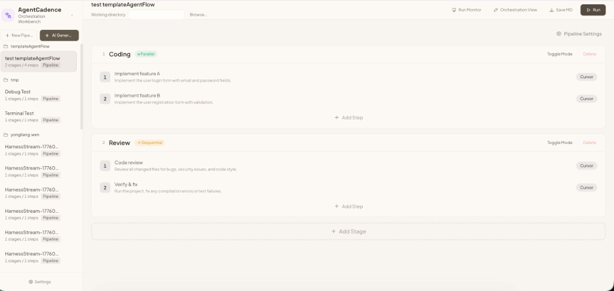

<p align="center">
  
</p>

<h1 align="center">AgentCadence</h1>

<p align="center">
  <a href="./README.md">English</a> · <a href="./README.zh-CN.md">中文</a>
</p>

<p align="center">
  一个面向 Cursor、Claude Code 和 Codex 的 Web 编排工作台。
</p>

<p align="center">
  你可以在浏览器里设计多阶段 Pipeline，调用本机 Agent CLI 执行任务，实时查看转录流式活动记录，并统一管理模板、自动化触发器和运行历史。
</p>

## 产品预览

编排工作台用于可视化搭建 Pipeline：多阶段流程、阶段内串行或并行步骤、按步骤配置工具与提示词，以及从浏览器一键运行（CLI 实际在服务端所在机器上执行）。

<p align="center">
  
</p>

## 为什么是 AgentCadence

AgentCadence 解决的是“单个 agent 对话”和“完整 CI 系统”之间的空白地带。
它让你把真实的本地 CLI agent 组合成可重复执行的 Pipeline，用依赖、重试和历史记录把它们串起来，并在浏览器里按步骤查看到底发生了什么。

典型使用方式包括：

- 实现 → Review → Verify
- 一个阶段内并行跑多个特性任务，再汇总到 Review
- 通过定时调度或 Webhook 自动触发已有 Pipeline
- 把常用流程保存成模板复用

## 核心能力

| 模块 | 能力 |
| --- | --- |
| Pipeline 编辑器 | 多阶段 Pipeline，支持串行/并行执行、自定义命令、重试策略、按步骤选择工具和模型 |
| 工具支持 | 内建 Cursor、Claude Code、Codex 配置，可检测本机可执行文件并设置基础参数 |
| 运行监控 | 实时转录流活动面板、原始日志、运行历史、按步骤状态追踪，以及新运行的持久化回放 |
| 自动化 | 在设置中统一管理 Schedules、Webhooks 和回调 / post-action |
| 工作区能力 | 模板、洞察、工作目录选择、全局变量复用 |
| 运行时 | React + Vite 前端，Express + WebSocket 服务端，基于 `node-pty` 的终端流式执行 |

> [!IMPORTANT]
> AgentCadence 不是在浏览器里运行 CLI。
> 所有 Agent 命令都在 Node 服务所在的那台机器上执行，所以本地环境、凭证和 CLI 安装必须先可用。

## 快速开始

### 环境要求

- Node.js 18+
- npm
- 你要使用的 Agent CLI，例如 `cursor-agent`、`claude`、`codex`

### 安装

```bash
git clone https://github.com/toddwyl/AgentCadence.git
cd AgentCadence
npm install
```

### 开发模式

```bash
npm run dev
```

会启动：

- API 服务，端口为 `PORT` 或默认 `3712`
- Vite 前端，端口为 `5173`，并代理 API 和 WebSocket

如果 `3712` 已被占用，开发脚本会直接报错，而不是悄悄连到错误的旧进程。

### 生产构建

```bash
npm run build
npm start
```

默认地址：

```text
http://localhost:3712
```

也可以自定义端口：

```bash
PORT=3812 npm start
```

## 首次使用建议

1. 打开 **Settings**。
2. 配置 Cursor、Claude、Codex 的 CLI profile。
3. 设置工作目录。
4. 创建一个 Pipeline，或者从模板开始。
5. 运行后在活动面板里查看实时转录流。

AgentCadence 的本地数据默认保存在：

```text
~/.agentcadence
```

其中包括 pipelines、templates、schedules、webhooks、CLI profile 和其他运行时状态。

## 工作方式

每个 Pipeline 由多个 stage 组成，每个 stage 下有一个或多个 step。
Stage 之间可以顺序执行，而 stage 内的 step 可以根据模式选择串行或并行。

每个 step 可以：

- 指定工具和模型
- 填写自然语言 prompt
- 可选地用自定义 shell 命令覆盖默认执行
- 根据失败策略自动重试
- 输出实时 transcript 事件和原始终端日志

## 亮点

### 以转录流为中心的运行监控

执行监控不是简单的工具事件堆叠，而是更偏“可阅读过程”的 transcript 视图。
高价值叙述会保持突出，低价值命令、编辑和探索活动可以折叠或按需展开。

### 内建自动化入口

自动化已经统一收进 Settings，包括：

- Pipeline 定时调度
- Webhook 触发运行
- 回调 / post-action 绑定

这样一次性运行和持续触发都在一个产品表面里完成。

### 模板和洞察

你可以把 Pipeline 保存成模板，导入导出 Markdown 模板，并在内建洞察页查看使用情况和运行统计。

## 开发

常用命令：

```bash
npm run dev
npm run build
npm run test
npm run test:harness
```

> [!IMPORTANT]
> 这个仓库的强制测试门禁是 `bash scripts/harness.sh`。
> 只有它通过，改动才算真正验证完成。

Harness 会覆盖：

- client 和 server 的生产构建
- 自动挑空闲端口起服务
- `node-pty` spawn-helper 和 PTY 路径探测
- Playwright 对 shell command 和默认 Cursor 工具路径的流式校验

## 仓库结构

```text
src/client        React 前端
src/server        Express 路由和执行服务
src/shared        共享类型与 merge 逻辑
scripts           Harness、E2E 辅助脚本、开发工具
docs              截图和说明文档
```

## 说明

- 更完整的历史回放只对较新的运行记录可用。
- 浏览器只是控制面板，真正的 CLI 执行、环境检测和本地文件访问都发生在服务端宿主机上。
- 如果某个 CLI 在终端里能跑，但在 AgentCadence 里不行，优先检查 Settings 里的对应 profile。
